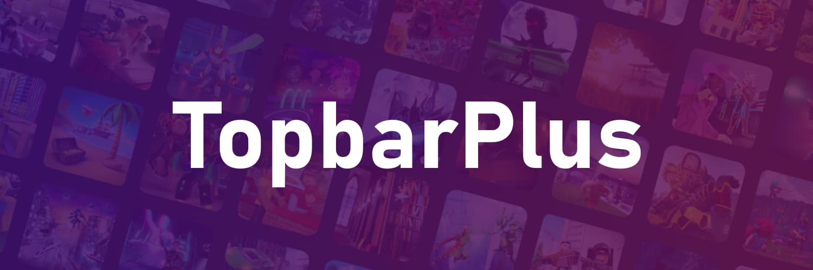

# TopbarPlus



<div align="center">
<a href="https://devforum.roblox.com/t/topbarplus-v291-construct-intuitive-topbar-icons-customise-them-with-themes-dropdowns-captions-labels-and-much-more/1017485">💾 Devforum</a> | <a href="https://1foreverhd.github.io/TopbarPlus">📖 Documentation</a> | <a href="https://www.roblox.com/games/15965809169">🌊 Playground</a>
</div>
<br>

Construct dynamic and intuitive topbar icons. Enhance the appearance and behaviour of these icons with features such as themes, dropdowns and menus.

## ⌨️ Examples

```lua
-- This assumes you place the TopbarPlus module (called 'Icon') under ReplicatedStorage
local Icon = require(game:GetService("ReplicatedStorage").Icon)

-- Here we construct a simple icon
Icon.new()
 :setImage(6326373239)
 :setLabel("Nanoblox")
```

## 🚀 Features


## Links

- [✨ What's new](https://github.com/1ForeverHD/TopbarPlus/releases)
- [🎬 Get Started](https://1foreverhd.github.io/TopbarPlus/)
- [📦 Installation](https://1foreverhd.github.io/TopbarPlus/installation/)
- [💡 API](https://1foreverhd.github.io/TopbarPlus/api/icon/)

## Credit

Big thanks to these people for their resources and contributions:

- [@Quenty](https://devforum.roblox.com/u/quenty)’s [Maid](https://github.com/Quenty/NevermoreEngine/blob/8ef4242a880c645b2f82a706e8074e74f23aab06/Modules/Shared/Events/Maid.lua) and [Signal](https://github.com/Quenty/NevermoreEngine/blob/1bed579e0fc63cf4124a1e50c2379b8a7dc9ed1d/Modules/Shared/Events/Signal.lua)
- [@Lucke0051](https://devforum.roblox.com/u/lucke0051) for his many feature ideas and code contributions
- [@cxmeels](https://devforum.roblox.com/u/cxmeels) for assistance with overflows
- [@MrAsync](https://devforum.roblox.com/u/mrasync) for workflow guidance
- [@grilme99](https://devforum.roblox.com/u/grilme99) for their [TS port](https://github.com/grilme99/TopbarPlus)
- [@Inctus](https://devforum.roblox.com/u/inctus) for the [video tutorial](https://www.youtube.com/watch?v=c_emUAWTRKg)

## Final

TopbarPlus is free and open source! You’re welcome to use and modify this for any of your projects. Credit back to this thread is greatly appreciated although I won’t send the popo after you if you don’t. 👮

I won’t be able to respond to all questions, however I pinky-promise that I’ll read your comments. We’ve put hundreds of hours into this resource so its always a joy to hear your feedback!

That’s all amigos, enjoy 🍍
